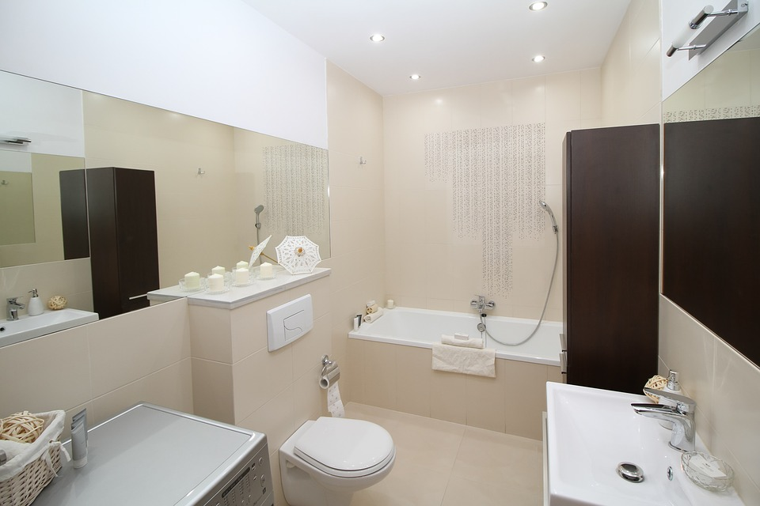
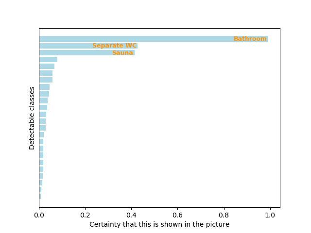
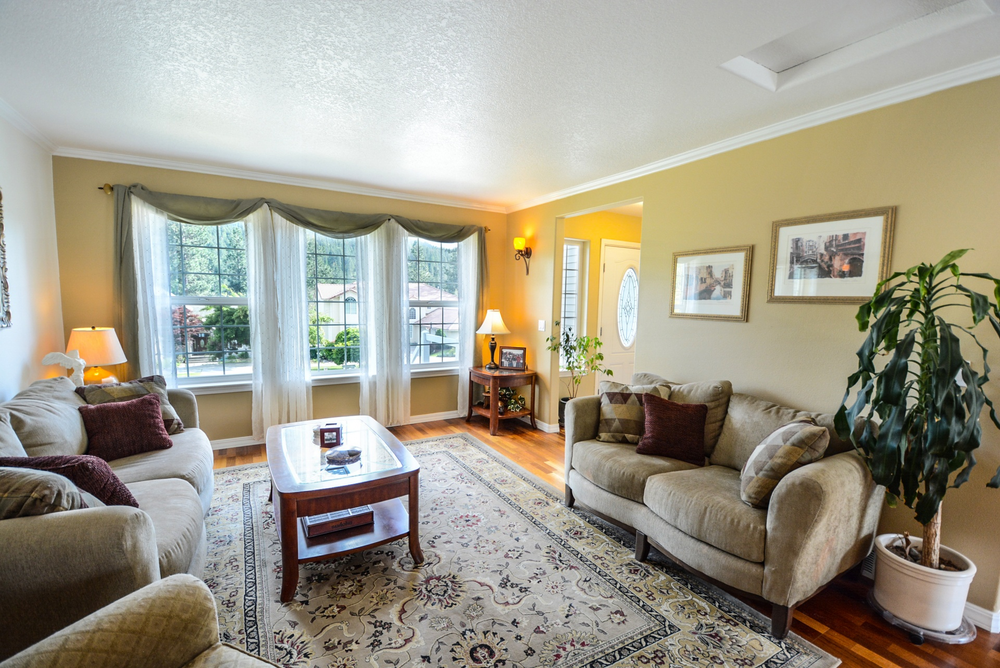
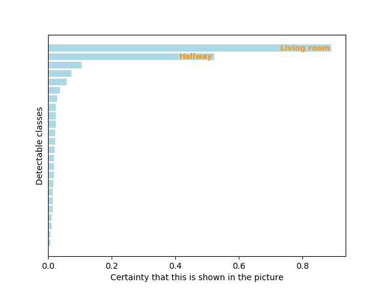
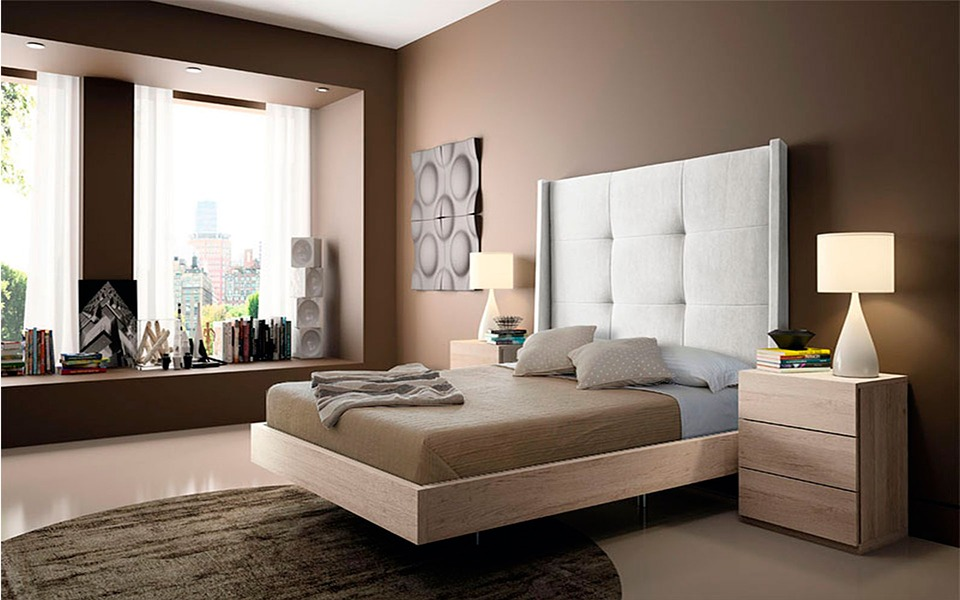
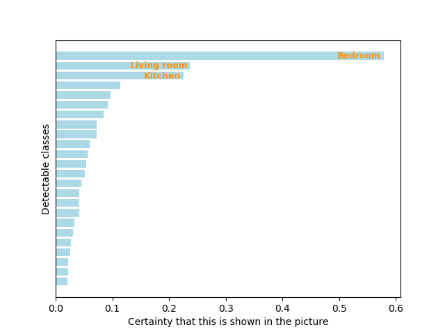
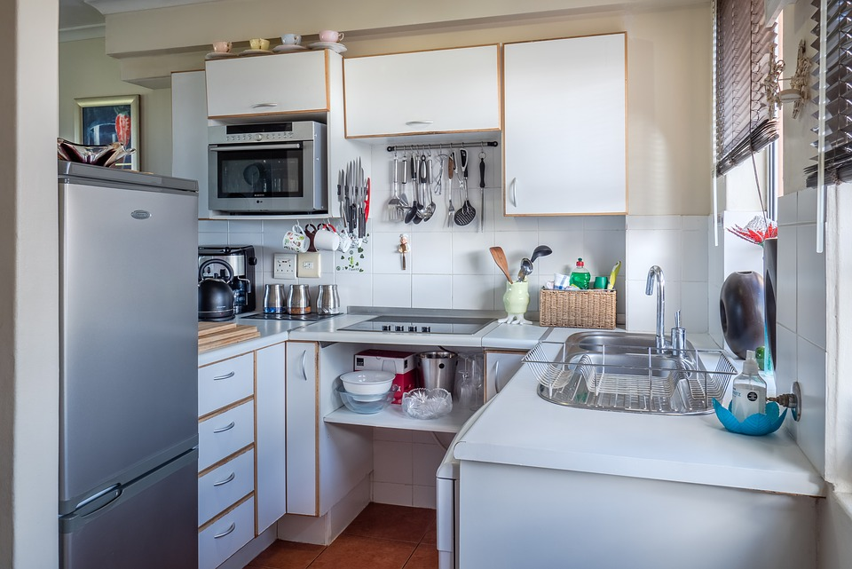
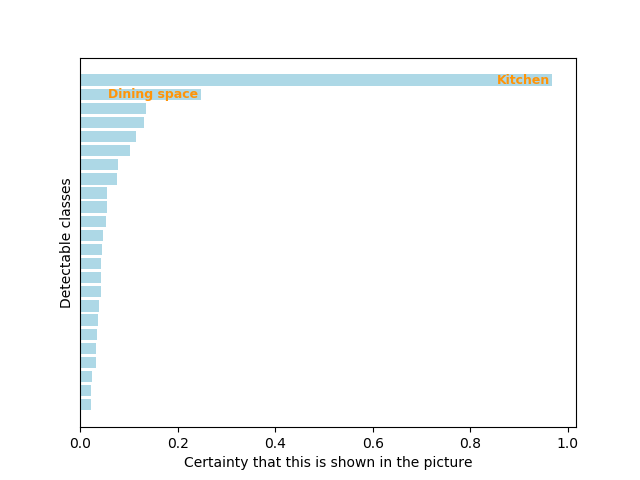

# Multi-label image classification of apartment rooms, using Inception v3

In this project, we built a model for classifying images of rooms and houses. The model is based on a convolutional neural network called [Inception v3](https://arxiv.org/abs/1512.00567), which we modified for our purpose. Using this model as a predictor allows you to obtain probabilities for classes of room types (e.g. "Living room" - 0.95, "Kitchen" - 0.33, etc.) for every picture on which you run the model.

The folder ``cnn`` contains the weights files for neural network. The folder ``pictures`` contains a couple of example pictures of rooms for which you can try our prediction model. You can also add a new picture to the folder and test it on your own photographs. The Jupyter notebook file ``label_a_picture.ipynb`` contains code that makes inference straight forward.

If you want to predict classes for a new picture, the only thing you need to do is change the file path to the new picture in the notebook file. The notebook will show you a vizualization of probabilities for the different classes as well as how your picture looks after resizing, right before it is handed to the neural network.

**IMPORTANT**: Before running the model, you need to merge weights files into one (GitHub doesn't allow big files so we had to split them). Run command ``cat part* > weights.30.h5`` in ``cnn`` folder.

### Requirements
Python 3, Jupyter, Numpy, Pandas, Keras, Tensorflow, Matplotlib, Pillow.

### Examples

#### 1) BATHROOM

<b>Predictions:</b>
('Bathroom', 0.99298614),
 ('Separate WC', 0.4273895),
 ('Sauna', 0.41346362),
 ('Balcony', 0.07979015),
 ('Living room', 0.067150824),
 ('Utility room', 0.059688784),
 ('Room', 0.059630696),
 ('WC', 0.04717016),
 ('Facade', 0.043306354),
 ('Dining space', 0.03712538),
 ('Clothes room', 0.03475352),
 ('Alcove', 0.0312262),
 ('Open kitchen', 0.029436737),
 ('Kitchen', 0.029092003),
 ('Downstairs', 0.020234395),
 ('Floor plan', 0.019936427),
 ('Yard', 0.019890068),
 ('Bedroom', 0.019755764),
 ('Other', 0.019607058),
 ('Hallway', 0.018841224),
 ('House', 0.017442567),
 ('Upstairs', 0.014777068),
 ('Fireplace', 0.010053921),
 ('Terrace', 0.0090487925)

#### 2) LIVING ROOM

<b>Predictions:</b>
('Living room', 0.8914378),
 ('Hallway', 0.52240777),
 ('Bedroom', 0.10577865),
 ('Open kitchen', 0.073229395),
 ('Kitchen', 0.0593748),
 ('Dining space', 0.038205028),
 ('Room', 0.027904654),
 ('Downstairs', 0.024915138),
 ('Balcony', 0.02476451),
 ('Terrace', 0.02393832),
 ('Clothes room', 0.022451365),
 ('Upstairs', 0.022246208),
 ('Facade', 0.02119123),
 ('Utility room', 0.018733462),
 ('WC', 0.018732475),
 ('Alcove', 0.018207276),
 ('House', 0.01784573),
 ('Floor plan', 0.01559417),
 ('Separate WC', 0.015244999),
 ('Other', 0.014831147),
 ('Fireplace', 0.011409365),
 ('Yard', 0.010814194),
 ('Bathroom', 0.0080595175),
 ('Sauna', 0.007104769)

#### 3) BEDROOM

<b>Predictions:</b>
('Bedroom', 0.5793384),
 ('Living room', 0.23728992),
 ('Kitchen', 0.22549711),
 ('Separate WC', 0.113717355),
 ('Hallway', 0.09639142),
 ('Room', 0.09177687),
 ('Alcove', 0.084615275),
 ('Sauna', 0.072616875),
 ('Other', 0.07186644),
 ('Bathroom', 0.05983949),
 ('Dining space', 0.05678303),
 ('Clothes room', 0.05439208),
 ('WC', 0.051762555),
 ('Open kitchen', 0.04568403),
 ('Utility room', 0.041744404),
 ('House', 0.04138852),
 ('Downstairs', 0.04113735),
 ('Upstairs', 0.032588378),
 ('Yard', 0.030093836),
 ('Fireplace', 0.027557233),
 ('Terrace', 0.025757447),
 ('Balcony', 0.022647457),
 ('Facade', 0.021785261),
 ('Floor plan', 0.020397851)

#### 4) KITCHEN

<b>Predictions:</b>
('Kitchen', 0.9681575),
 ('Dining space', 0.2476543),
 ('Separate WC', 0.13429703),
 ('Sauna', 0.13073911),
 ('Open kitchen', 0.115079366),
 ('Living room', 0.10308642),
 ('Bathroom', 0.077656716),
 ('Upstairs', 0.075108156),
 ('House', 0.055733964),
 ('Facade', 0.0557055),
 ('Hallway', 0.053430118),
 ('WC', 0.04658698),
 ('Room', 0.04414871),
 ('Floor plan', 0.043954514),
 ('Terrace', 0.04353497),
 ('Fireplace', 0.043499306),
 ('Other', 0.038958393),
 ('Alcove', 0.03611775),
 ('Yard', 0.033846766),
 ('Utility room', 0.03366604),
 ('Clothes room', 0.033268627),
 ('Downstairs', 0.023928167),
 ('Bedroom', 0.022849493),
 ('Balcony', 0.022471499)

[Sources](https://github.com/mgierlach/inc3-cnn-apartment-room-classification/blob/master/pictures/picture_credits.txt) of above pictures

Created by Mateusz Gierlach, Moritz Lange, Heikki Sarajärvi
